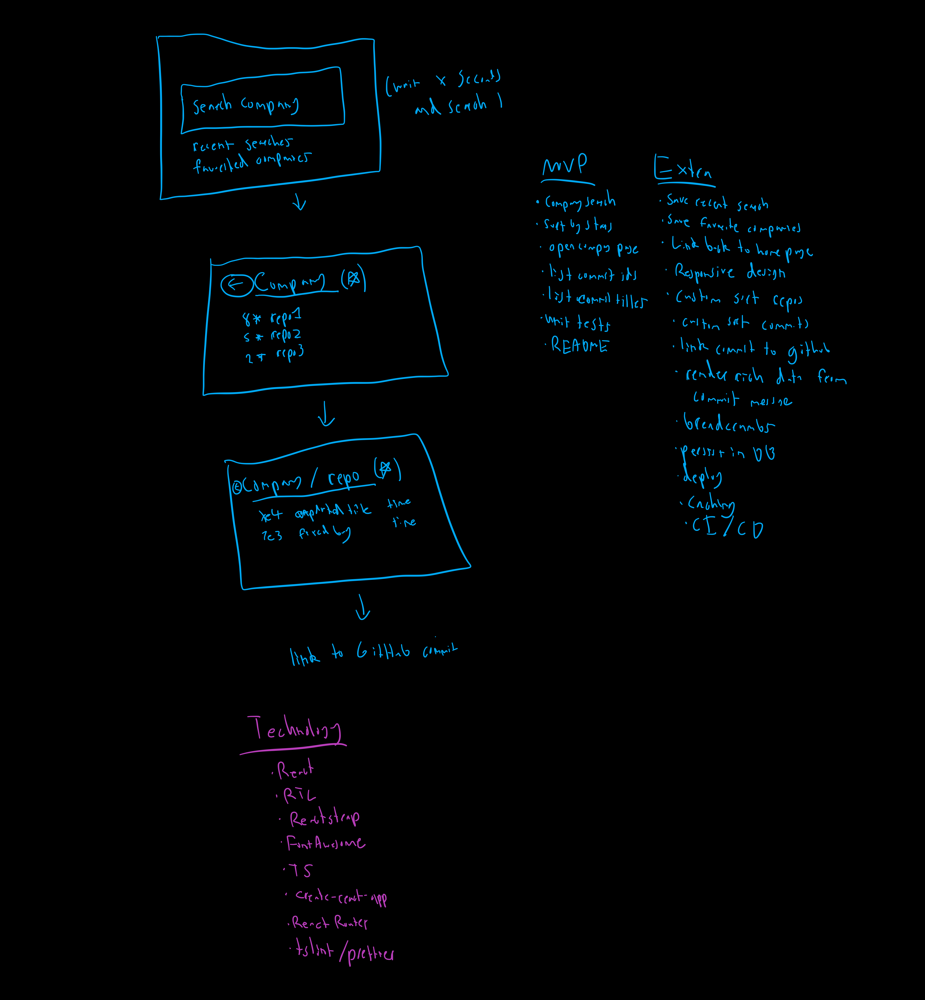

# GitHub Organization Searcher

Search for organizations on GitHub. After searching for an organization explore popular repos and commits within that repo.

## How to use

- Deployed at https://github-org-search.herokuapp.com/
- Run manually with `npm run start` after installing dependencies (`npm i`)

## Functionality

1. Search for an organization on GitHub using the searchbar in the header at the top
   1. Repos for that organization will be listed, sorted by the number of issues in that repo
   2. Click the column headers to update the sort
   3. Search for a specific repo using the inline search in the top right of the table
   4. Expand a repo to see the latest commits for that repo
      1. Click a commit to open a dialog with more info
      2. Click the commit SHA to go to the commit on GitHub
      3. Click the author to open their GitHub profile

## Technology

- `React`
- `TypeScript`
- `Material UI`
- `Font Awesome` (`Fort Awesome`)
- `create-react-app`
- `GitHub API`
- `jest`
- `react-router-dom`
- `axios`
- `material-table`
- `eslint`
- `heroku`
- `boostrap` (`react-bootstrap`)

## Future development

- UI cleanup
- Better responsive design for mobile
- Save/star favorite orgs/repos/commits
- More info when viewing a commit

## Brainstorm

## Testing

### Unit Tests

- Run unit tests with `npm run test`
- All unit tests can be found under the `test` directory, named as `File.test.tsx` (for example, `src/test/components/RepoTable.test.tsx`)
- Data for unit tests can be found under `src/test/data`

### Manual Testing

Follow the above functionality guide for information on on scenarios to test after running `npm i && npm run start`